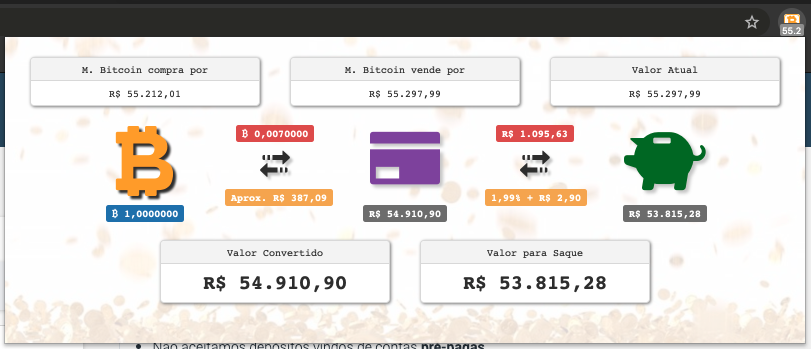

# myBitcoins - Chrome Extension

*Essa extensão tem como objetivo acompanhar em tempo real a valorização/desvalorização
do bitcoin no **Mercado Bitcoin**.*



## API utilizada do Mercado Bitcoin

```
v3 - https://www.mercadobitcoin.com.br/api-doc/
```

## Instalação do Projeto

Executar npm
```sh
npm install
npm run production
mv app/env_example.json app/env.json
```
Edite o arquivo `app/env.json` inserindo seu TAPI_ID e SECRET gerado no site do Mercado Bitcoin

## Instalação no Google Chrome

*Importar somente a pasta `app/` do projeto nas Extensões do Chrome:*
- [chrome://extensions](chrome://extensions)

***Obs:** Caso não veja a opção para importar uma extensão, selecione o modo desenvolvedor.*
